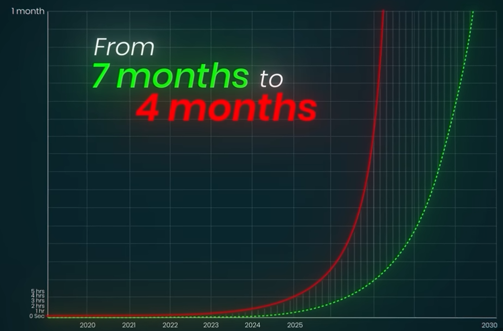
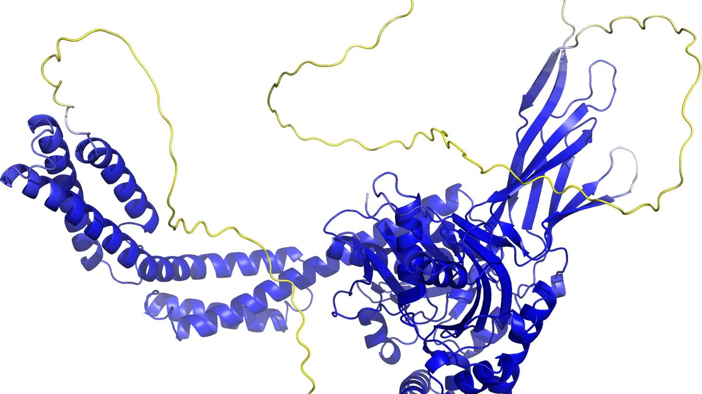

# KI in Bildern: Wachstum, Forschung und Grenzen

Kurze Einordnung aktueller KI-Entwicklungen – mit Visualisierungen aus dem Workshop.

---

## Moore's Law vs. KI-Wachstum

> Durch algorithmische Fortschritte, Daten und Skalierung wächst KI nicht nur schneller als durch Hardware allein – sie übertrifft klassische Technologietrends deutlich.

---

## Aufgabenkomplexität verdoppelt sich etwa alle vier Monate

> Die Länge und Komplexität von Aufgaben, die KI-Systeme selbstständig lösen können, hat sich in den letzten Jahren etwa alle vier Monate verdoppelt – deutlich schneller als das Moore'sche Gesetz der Halbleiterindustrie.

---

## KI und Cybersicherheit

> Moderne KI kann Sicherheitslücken in Software automatisch erkennen. Deshalb veröffentlichen einige Unternehmen ihre leistungsfähigsten Modelle nicht vollständig offen – um Missbrauch für Cyberangriffe zu erschweren.

---

## Pong mit Gehirnzellen im Labor

> Im Labor lernte ein Verbund aus 800.000 Gehirnzellen das Computerspiel Pong zu spielen, indem sie über elektrische Signale trainiert wurden.

---

## Materialforschung: Millionen neue Kristallstrukturen (GNoME)

Die Google-DeepMind-KI **GNoME** (*Graph Networks for Materials Exploration*) entdeckte in Rekordzeit **2,2 Millionen neue Kristallstrukturen**. Das entspricht einem simulierten Forschungsfortschritt von **800 Jahren** und vergrößert das bekannte Wissen über stabile Materialkombinationen um das **45-Fache**.

---

## Gehirn der Fruchtfliege digital kartiert

> Forscher kartierten und simulierten erstmals das gesamte Gehirn einer Fruchtfliege digital. Das Modell umfasst rund 140.000 Nervenzellen und über 50 Millionen Verbindungen – und hilft, die Funktionsweise komplexer Gehirne besser zu verstehen.

