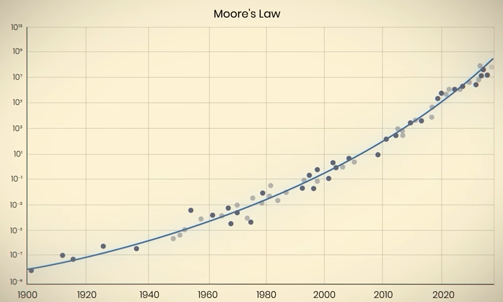
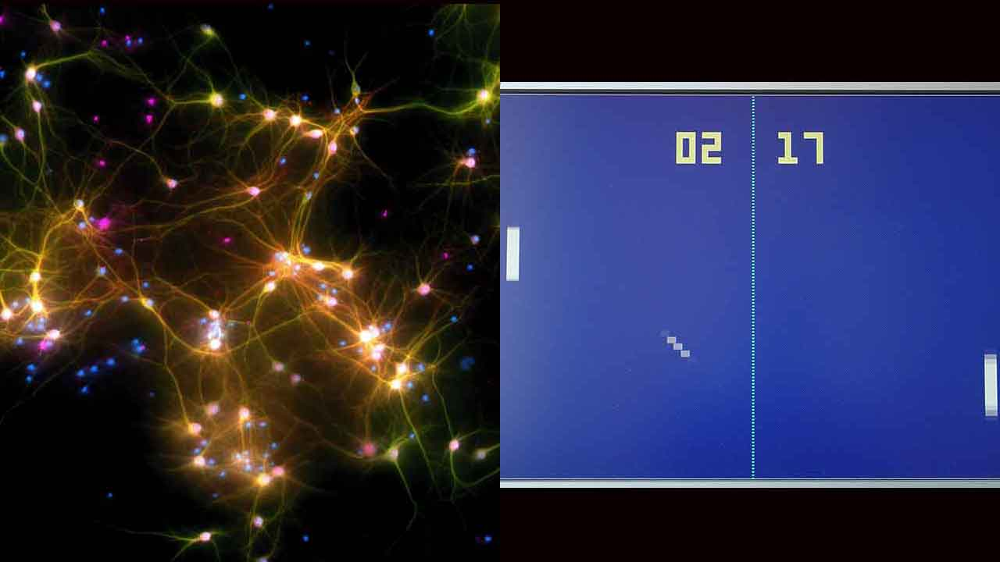
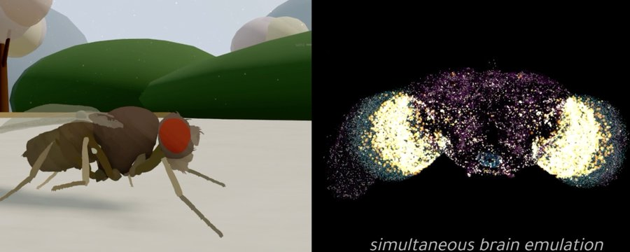

# KI in Bildern: Wachstum, Forschung und Grenzen

Kurze Einordnungen zu aktuellen KI-Entwicklungen – mit Visualisierungen aus dem Workshop.

---

## Moore's Law vs. KI-Wachstum

> Damit wächst KI nicht nur schneller durch Hardware, sondern durch algorithmische Fortschritte, Daten und Skalierung – und übertrifft klassische Technologie-Trends deutlich.

---

## Aufgabenkomplexität verdoppelt sich alle ~4 Monate

> Die Länge und Komplexität von Aufgaben, die KI-Systeme selbstständig lösen können, hat sich in den letzten Jahren etwa alle 4 Monate verdoppelt – deutlich schneller als das klassische Moore's Law der Halbleiterindustrie.

---

## KI und Cybersicherheit

> Moderne KI kann Sicherheitslücken in Software automatisch erkennen. Aufgrund dieses Potenzials veröffentlichen einige Unternehmen ihre leistungsfähigsten KI-Modelle nicht vollständig offen, um Missbrauch für Cyberangriffe zu erschweren.

---

## Pong mit Gehirnzellen im Labor

> Im Labor lernte ein Verbund aus 800.000 Gehirnzellen, das Computerspiel Pong zu spielen, indem er über elektrische Signale trainiert wurde.

---

## Materialforschung: Millionen neue Kristallstrukturen (GNoME)

Die Google-DeepMind-KI **GNoME** (*Graph Networks for Materials Exploration*) hat in Rekordzeit **2,2 Millionen neue Kristallstrukturen** entdeckt. Das entspricht einem simulierten Forschungsfortschritt von **800 Jahren** und vergrößert das bekannte Wissen über stabile Materialkombinationen um das **45-Fache**.

---

## Fruchtfliegen-Gehirn digital kartiert

> Forscher haben erstmals das gesamte Gehirn einer Fruchtfliege digital kartiert und simuliert. Das Modell umfasst rund 140.000 Nervenzellen und über 50 Millionen Verbindungen und hilft dabei, die Funktionsweise komplexer Gehirne besser zu verstehen.

