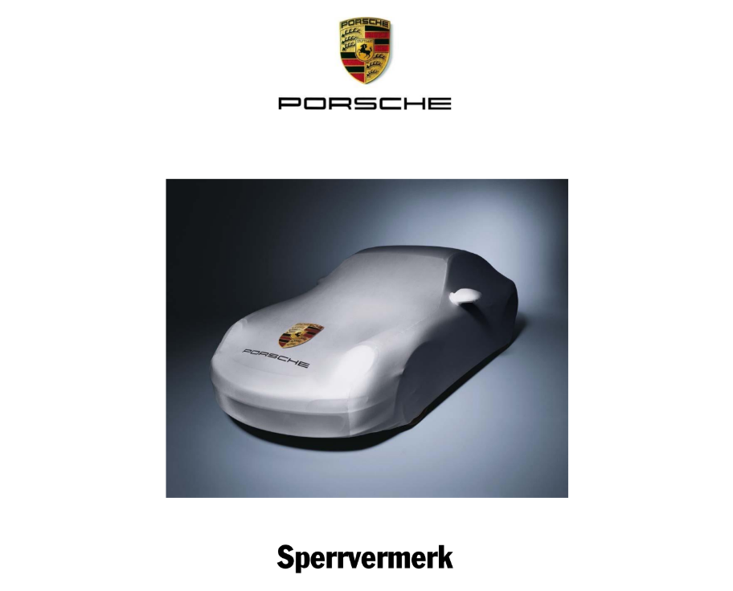
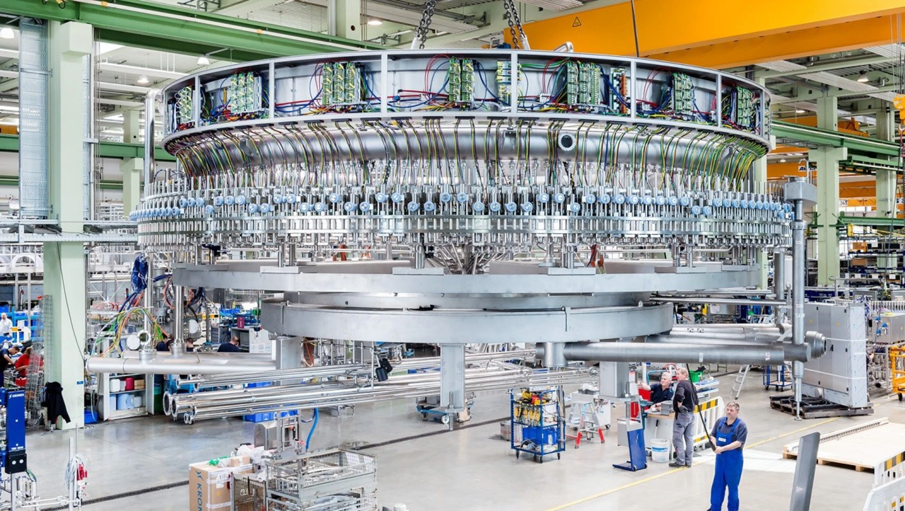
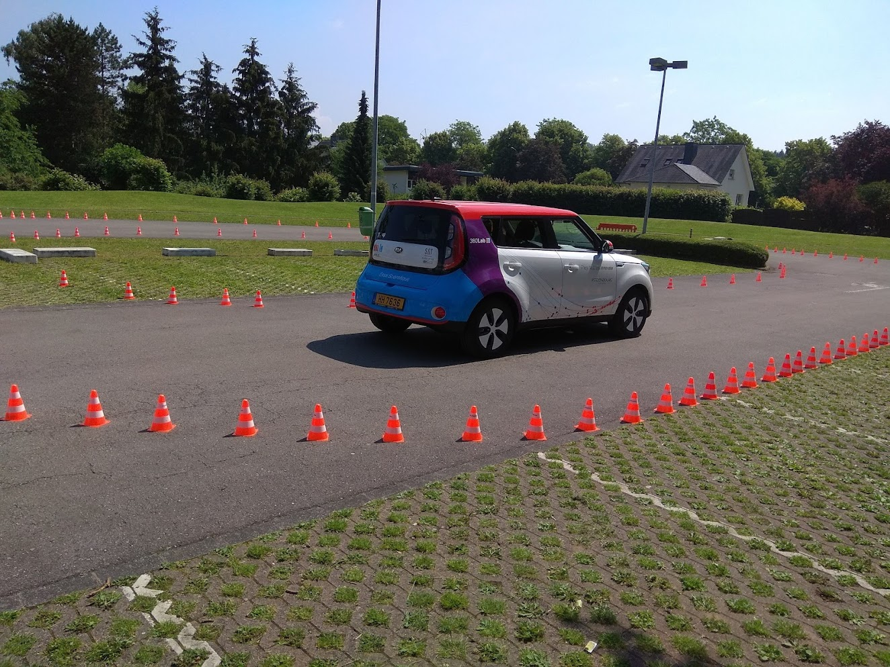
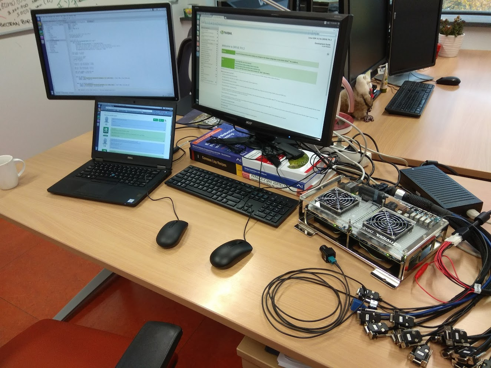

# Sandro Mund

[LinkedIn-Profil](https://www.linkedin.com/in/sandro-mund/)

**Qualifikation**

- IT-Systemkaufmann
- Anwendungsentwickler
- Master of Science in Informatik

---

## BBG Betriebsberatungs GmbH

Sandro Mund ist Head of IT bei der **BBG Betriebsberatungs GmbH** in Bayreuth. Er ist ausgewiesener Experte für Künstliche Intelligenz (KI) und Maschinelles Lernen.

Die BBG Betriebsberatungs GmbH ist ein unabhängiger Partner der Versicherungs- und Finanzbranche und betreibt ein Ökosystem, das Versicherer und Makler miteinander verbindet.

Über verschiedene Plattformen, Medien und Events schafft BBG Reichweite, Austausch und Networking im Markt – insbesondere durch die Leitmesse **DKM**, das Fachmedium **AssCompact** sowie das Nachwuchsformat **Jungmakler**.

---

## consistec Engineering & Consulting GmbH

IT- und Softwareunternehmen, das maßgeschneiderte, sichere Softwarelösungen sowie Monitoring- und Netzwerk-Analyse-Systeme für technische und digitale Infrastrukturen entwickelt.

Dort arbeitete Sandro Mund im Bereich **IT-Sicherheit mit KI** – unter anderem an **Angriffserkennung** und **Abwehr** (Defense) gegen Cyberangriffe.

---

## Dr. Ing. h.c. F. Porsche AG – Masterarbeit

**Thema:** Identifikation abstrakter Szenarien in aufgezeichneten Sensordaten für autonomes Fahren.

> Die vorliegende Abschlussarbeit enthält zum Teil Informationen, die nicht für die Öffentlichkeit bestimmt sind. Während einer Sperrzeit von fünf Jahren ab dem Abgabedatum liegt das alleinige Recht zur Verwertung, insbesondere zur Verbreitung der Abschlussarbeit – auch auf elektronischen Medien – bei der Dr. Ing. h.c. F. Porsche AG.

---

## Krones AG

**Krones AG** liefert Anlagen für die Getränkeindustrie und Nahrungsmittelhersteller – von Prozesstechnik und Fülltechnik über Verpackungsmaschinen bis hin zu IT-Lösungen.

**Schwerpunkte mit KI und Machine Learning:**

- Deep Learning für Big-Data-Anwendungen in **CAD** und **PLM**
- Machine-Learning-Tool zur **Vorhersage von Layout und Ressourcenverbrauch** (z. B. Strom, Druck, Heizung, Kühlung) einer Stretch-Blow-Molding-Maschine auf Basis kundenspezifischer Anforderungen
- Machine-Learning-Tool zur **Erkennung und Erklärung von Zusammenhängen** in einer Stretch-Blow-Molding-Maschine im Closed Loop

---

## Universität Luxemburg – Forschung autonomes Fahren

Am **360Lab** (*Interdisciplinary Centre for Security, Reliability and Trust*) standen praxisnahe Versuche mit Forschungsfahrzeugen und leistungsfähiger Entwicklungshardware im Mittelpunkt – von Testfahrten auf markierten Parcours bis zur Auswertung von Sensordaten auf spezialisierten Rechnern.

